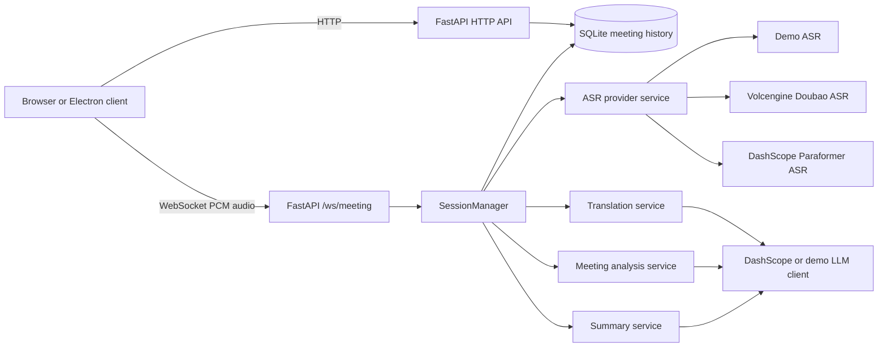
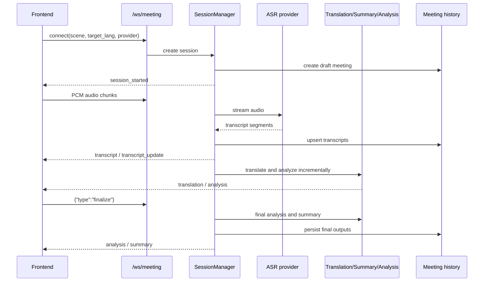
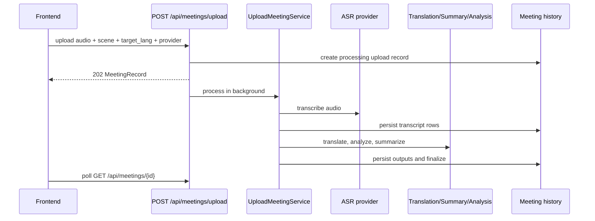
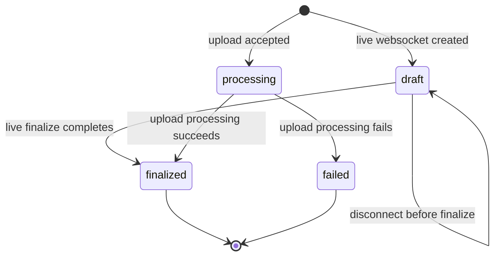

# Architecture

Language:
- English: `architecture.md`
- 简体中文: [zh/architecture.md](zh/architecture.md)

Smart Meeting Assistant has a React/Vite frontend, a FastAPI backend, provider clients for ASR and LLM workflows, and SQLite-backed meeting history.

## System Overview

## Live Meeting Flow

## Upload Meeting Flow

## Meeting State

## Important Boundaries

- `backend/app/clients/` owns provider-specific network clients and protocol adapters.
- `backend/app/services/asr_provider_service.py` chooses the active ASR provider and fallback order.
- `backend/app/services/session_manager.py` owns live WebSocket session state and persistence.
- `backend/app/services/upload_meeting_service.py` owns uploaded-audio processing.
- `frontend/src/app/` owns the main workspace and meeting panels.
