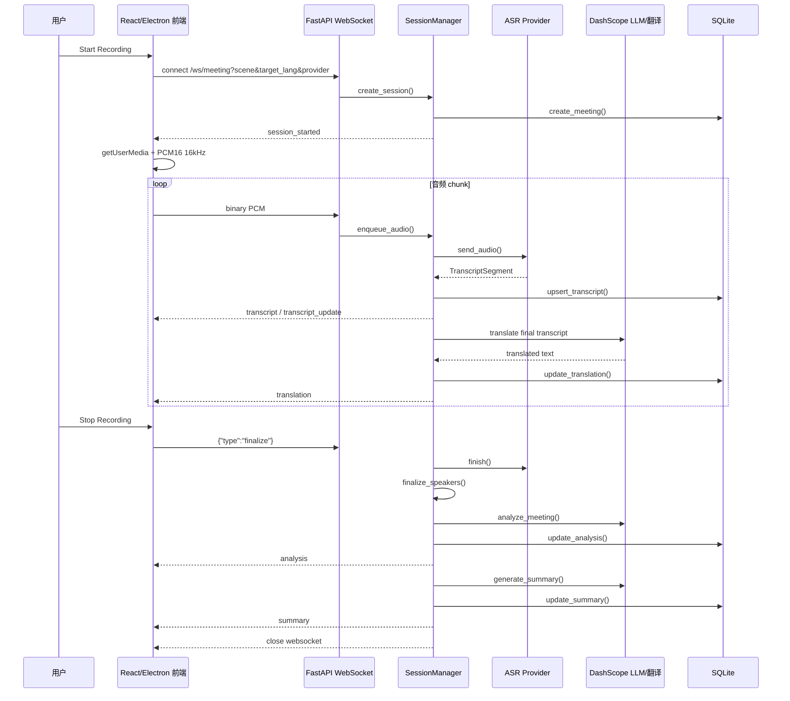
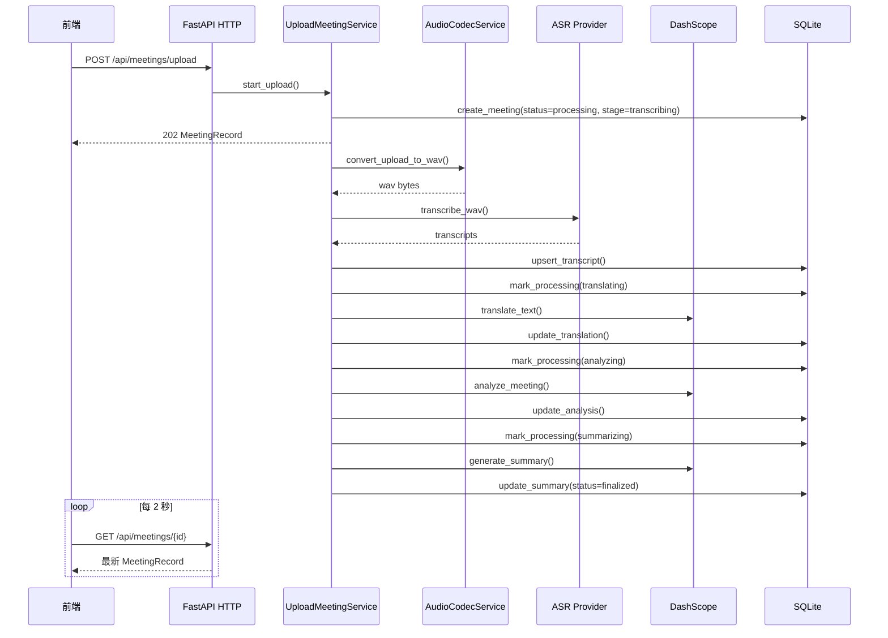

# Smart Meeting Assistant 中文技术实现文档

Language:
- English: [../technical-implementation.md](../technical-implementation.md)
- 简体中文: `technical-implementation.md`

本文档基于 `docs/requirements/project-requirements.md` 中提出的五项核心功能，结合当前仓库代码说明系统如何实现这些能力。

## 1. 项目整体架构

项目采用“前端 React/Electron + 后端 FastAPI + 第三方 AI 服务 + SQLite 持久化”的结构。

```text
smart-meeting-assistant/
├─ backend/
│  └─ app/
│     ├─ main.py                         # FastAPI 应用启动与服务装配
│     ├─ api/                            # HTTP / WebSocket API
│     ├─ clients/                        # 第三方 ASR / LLM 客户端
│     ├─ services/                       # 业务服务层
│     └─ schemas/                        # Pydantic 数据结构
├─ frontend/
│  ├─ src/
│  │  ├─ app/App.tsx                     # 前端主状态机与页面编排
│  │  ├─ app/components/                 # Transcript / Summary / Actions / Analysis 等面板
│  │  ├─ hooks/useAudioRecording.ts      # 浏览器麦克风采集与 PCM 编码
│  │  ├─ hooks/useWebSocket.ts           # 实时会议 WebSocket 客户端
│  │  └─ types/index.ts                  # 前后端共享形态的 TypeScript 类型
│  └─ electron/main.cjs                  # Electron 桌面壳
└─ data/meeting_history.sqlite3          # SQLite 会议历史数据库
```

后端启动入口是 `backend/app/main.py`。FastAPI 的 `lifespan` 在服务启动时创建并挂载以下对象到 `app.state`：

- `DashScopeASRClient`：DashScope 实时/批量语音识别客户端。
- `VolcengineASRClient`：火山引擎 ASR 客户端，默认实时识别 provider。
- `DemoASRClient`：`DEMO_MODE=1` 时可用的确定性本地 ASR provider。
- `DashScopeClient` / `DemoDashScopeClient`：真实或 demo 的大模型对话与翻译请求客户端。
- `AudioCodecService`：用 ffmpeg 把上传音频转换成统一 WAV 格式。
- `ASRProviderService`：选择 ASR provider，并在失败时回退。
- `SpeakerService`：统一 transcript 的说话人字段。
- `DiarizationService`：基于 pyannote 的离线说话人分离。
- `SummaryService`：会议总结、决策、行动项提取。
- `SentimentAnalysisService`：会议情绪和参与度分析。
- `TranslationService`：逐条 transcript 翻译。
- `MeetingHistoryService`：SQLite 会议历史持久化。
- `UploadMeetingService`：上传音频的后台处理流程。
- `SessionManager`：实时 WebSocket 会议会话管理。

后端 API 路由也在 `main.py` 中注册：

- `backend/app/api/websocket.py`：`/ws/meeting` 实时会议 WebSocket。
- `backend/app/api/meetings.py`：会议上传、历史列表、详情、编辑、删除。
- `backend/app/api/transcribe.py`：单次/批量上传音频转写接口。
- `backend/app/api/health.py`：健康检查。

## 2. 功能需求与代码实现总览

`docs/requirements/project-requirements.md` 要求的五项核心能力，在代码中分别落在以下模块：

| 需求 | 主要代码 | 实现方式 |
| --- | --- | --- |
| 实时语音转文字，支持多说话人 | `useAudioRecording.ts`、`useWebSocket.ts`、`api/websocket.py`、`SessionManager`、`ASRProviderService`、`VolcengineASRClient`、`DashScopeASRClient`、`DemoASRClient`、`DiarizationService` | 前端采集 16kHz PCM 音频，经 WebSocket 发给后端；后端调用 ASR provider 流式识别；火山引擎可返回实时说话人，DashScope 可通过 pyannote/diart 处理说话人，demo provider 可无外部 key 跑通链路 |
| 自动会议总结 | `SummaryService`、`MeetingSummary` schema、`SummaryPanel.tsx` | 会议结束或上传处理完成后，把 transcript 组装成 prompt，请 DashScope 输出结构化 JSON，再做规则补强与清洗 |
| 多语言会议翻译 | `TranslationService`、`DashScopeClient.translate_text`、`SessionManager._consume_translations`、`TranscriptPanel.tsx` | 每条最终 transcript 进入翻译队列，调用 DashScope 翻译模型，结果通过 WebSocket 返回并写入历史 |
| 上下文感知行动项提取 | `SummaryService`、`ActionItem` schema、`ActionItemsPanel.tsx`、`MeetingHistoryService.update_action_item_status` | 总结 prompt 要求模型输出 action_items；后端再用规则识别承诺、动作动词、负责人、截止时间并去重；前端支持状态切换和编辑 |
| 情绪和参与度分析 | `SentimentAnalysisService`、`MeetingAnalysis` schema、`MeetingAnalysisPanel.tsx` | 周期性或结束时调用大模型输出 overall_sentiment、engagement_level、signal_counts、highlights；失败时用规则 fallback |
| 持久化术语表 | `GlossaryStoreService`、`GlossaryService`、`/api/glossary/terms`、`MeetingProcessingSettings.tsx` | 已保存术语写入 SQLite，并在 live / upload 会议中自动合并，用于转写纠错、总结和分析 prompt |

## 3. 实时转写实现

### 3.1 前端采集麦克风音频

实时录音从 `frontend/src/app/App.tsx` 的 `handleStartRecording` 开始：

1. 前端根据当前场景、目标语言和 ASR provider 构造 WebSocket 地址：

   ```text
   ws://localhost:8080/ws/meeting?scene={scene}&target_lang={lang}&provider={provider}
   ```

2. 调用 `useWebSocket.connect()` 建立后端连接。
3. 调用 `useAudioRecording.startRecording()` 检查浏览器麦克风和音频处理能力，请求麦克风权限并启动音频处理。
4. `useAudioRecording.ts` 使用 `navigator.mediaDevices.getUserMedia()` 获取单声道音频，并开启浏览器的 echo cancellation、noise suppression、auto gain control。
5. Hook 监听麦克风 track 的 `ended` / `mute` / `unmute`、`AudioContext` 状态、页面可见性、`pagehide` 和 Wake Lock 可用性，移动端录音被系统中断时会给出明确状态提示。
6. Hook 创建 `AudioContext` 和 `ScriptProcessorNode`，在 `onaudioprocess` 中拿到 Float32 PCM。
7. 如果浏览器音频采样率不是 16000Hz，`downsampleAudio()` 会把音频降采样到 16kHz。
8. `encodePcm16Chunk()` 把 Float32 样本编码成小端 signed 16-bit PCM。
9. `onAudioData` 回调把每个 PCM chunk 交给 `useWebSocket.sendAudio()`。

这意味着后端实时 WebSocket 收到的是裸 PCM 片段，不是 WebM 文件。后端 ASR 流因此可以直接按 PCM 格式发送给 provider。

### 3.2 前端 WebSocket 消息处理

`frontend/src/hooks/useWebSocket.ts` 封装实时连接：

- `connect(url)`：创建 `WebSocket`，设置 8 秒连接超时。
- `sendAudio(audioChunk)`：连接处于 `OPEN` 时发送二进制音频。
- `finalize()`：发送 JSON 控制消息 `{ "type": "finalize" }`，等待后端正常关闭连接。
- `onmessage`：解析后端 JSON，根据 `message.type` 分发给 `App.tsx` 传入的回调。

后端会发送以下实时消息类型，类型定义位于 `backend/app/schemas/ws_message.py`，前端镜像位于 `frontend/src/types/index.ts`：

- `session_started`：会话创建成功，返回 `meeting_id`、场景、provider 等信息。
- `transcript`：新 transcript 片段。
- `transcript_update`：正在听写的 partial transcript 更新。
- `speaker_update`：结束后说话人分离结果回填。
- `translation`：某条 transcript 的翻译结果。
- `analysis`：会议情绪/参与度分析快照。
- `summary`：最终会议总结。
- `error`：错误信息。

### 3.3 后端 WebSocket 入口

实时入口在 `backend/app/api/websocket.py`：

1. `meeting_websocket()` 接受 `/ws/meeting` 连接。
2. 从 query 参数读取：
   - `scene`：会议场景，默认 `finance`。
   - `target_lang`：翻译目标语言。
   - `provider`：ASR provider。
3. 调用 `SessionManager.create_session()` 创建实时会议会话。
4. 循环读取 WebSocket 消息：
   - 如果是 bytes，就调用 `manager.enqueue_audio(session, payload)`。
   - 如果是 text，就尝试解析为 `FinalizeControlMessage`。
   - 收到 `{"type":"finalize"}` 后调用 `manager.finalize(session)`。
5. 连接断开或处理结束后调用 `manager.cleanup(session)` 清理任务、ASR 流、临时音频文件。

### 3.4 会话创建与音频消费

核心实时状态机在 `backend/app/services/session_manager.py`。

`MeetingSession` dataclass 保存一次会议的完整运行状态：

- `session_id`：会议 ID，也作为历史记录 ID。
- `scene`、`target_lang`、`active_provider`：当前会议配置。
- `audio_queue`：前端音频 chunk 队列。
- `translation_queue`：最终 transcript 的翻译任务队列。
- `transcripts`：会议内所有 transcript。
- `latest_analysis`、`analysis_task`：异步分析状态。
- `worker_task`：后台消费音频任务。
- `asr_stream`：当前 ASR provider 的流式连接。
- `session_audio_path`、`session_audio_writer`：用于离线 diarization 的临时 WAV。
- `active_partial_transcript_index`：火山引擎 partial transcript 的当前索引。

`create_session()` 做了这些事：

1. 用 `TranslationService.normalize_target_lang()` 校验目标语言。
2. 用 `ASRProviderService.resolve_provider()` 选择 ASR provider。
3. 生成 `session_id`。
4. 调用 `MeetingHistoryService.create_meeting()` 创建 SQLite 历史记录，状态默认为 `draft`。
5. 如果 provider 需要离线说话人分离，打开临时 WAV writer。
6. 启动 `_consume_audio(session)` 后台任务。
7. 如果配置了目标语言且翻译服务可用，启动 `_consume_translations(session)` 后台任务。
8. 发送 `session_started` 给前端。

`enqueue_audio()` 收到音频后做两件事：

1. 如果会话还没 finalize，把 chunk 写入 `audio_queue`。
2. 如果需要离线 diarization，同步把原始 PCM chunk 写入临时 WAV 文件。

`_consume_audio()` 是实时会议的主循环：

1. 检查当前 ASR client 是否配置。
2. 调用 `_start_asr_stream()` 创建 provider 流式识别连接。
3. 从 `audio_queue` 持续取出 PCM chunk。
4. 对每个 chunk 调用 `session.asr_stream.send_audio(payload)`。
5. 收到 `None` 表示 finalize，调用 ASR `finish()`。
6. 等待翻译队列完成。
7. 调用 `_finalize_speakers()` 做离线说话人分离回填。
8. 强制发送最终 `analysis`。
9. 强制发送最终 `summary`。
10. 关闭 WebSocket，结束本次会议。

### 3.5 ASR provider 选择与回退

`backend/app/services/asr_provider_service.py` 管理 provider。

当前支持：

- `volcengine`
- `dashscope`
- `demo`

默认 provider 由环境变量 `DEFAULT_ASR_PROVIDER` 控制，`backend/app/core/config.py` 中默认值是 `volcengine`。

选择逻辑：

1. 如果前端传入 provider 且在支持列表中，优先使用它。
2. 否则使用默认 provider。
3. 按候选顺序寻找已配置的 client。
4. 如果首选 provider 启动或转写失败，`resolve_fallback()` 会尝试回退到 DashScope。
5. 当 `DEMO_MODE=1` 时，demo provider 可作为无外部 key 的本地演示链路。

`ASRProviderSelection` 还包含 `should_run_diarization` 和 `should_run_realtime_diarization`。代码里只有当 provider 是 `dashscope` 且开启 offline/hybrid diarization 时，才启用 pyannote 或 diart 相关处理。原因是火山引擎路径本身尝试返回 speaker 信息，而 demo provider 直接返回固定 speaker label。

### 3.6 火山引擎实时 ASR

实现位于 `backend/app/clients/volcengine_asr_client.py`。

实时模式使用 `VolcengineASRStream`：

1. `start()` 连接 `VOLCENGINE_ASR_WS_URL`。
2. 请求头带上：
   - `X-Api-App-Key`
   - `X-Api-Access-Key`
   - `X-Api-Resource-Id`
   - `X-Api-Connect-Id`
3. `_send_full_client_request()` 发送初始化 frame，其中配置：
   - `format=pcm`
   - `rate=settings.sample_rate`
   - `channel=settings.audio_channels`
   - `show_utterances=True`
   - `enable_speaker_info=True`
4. `send_audio()` 把 PCM chunk gzip 后封装成火山引擎协议 frame。
5. `_read_events()` 持续读取服务端二进制 frame。
6. `_handle_frame()` 解压并解析 JSON payload。
7. `_emit_segments()` 提取 utterance：
   - `text`
   - `start_time`
   - `end_time`
   - `definite`
   - speaker 字段
8. 如果 `definite=False`，生成 partial transcript，前端会显示 `Listening...`。
9. 如果 `definite=True`，生成 final transcript，加入 `_segments` 并回调 `SessionManager._handle_segment()`。

火山引擎返回的 speaker 会通过 `_extract_speaker()` 从 utterance、additions、attribute 或 words 中提取。如果 speaker 是数字，会标准化成 `Speaker {n+1}`。

批量上传模式下，`VolcengineASRClient.transcribe_wav()` 连接 `VOLCENGINE_ASR_NOSTREAM_WS_URL`，以 WAV 格式分块发送整段音频。

### 3.7 DashScope 实时 ASR

实现位于 `backend/app/clients/dashscope_asr_client.py`。

`DashScopeASRStream` 的流程：

1. `start()` 连接 `DASHSCOPE_ASR_WS_URL`。
2. 请求头带 `Authorization: Bearer {DASHSCOPE_API_KEY}`。
3. 发送 `run-task` JSON：
   - `task_group=audio`
   - `task=asr`
   - `function=recognition`
   - `model=settings.dashscope_asr_model`
   - `format=pcm`
   - `sample_rate=16000`
4. 等待 `task-started`。
5. `send_audio()` 直接发送 PCM bytes。
6. `finish()` 发送 `finish-task`，等待 `task-finished`。
7. `_handle_event()` 处理 `result-generated`，从 `payload.output.sentence` 中提取：
   - `text`
   - `begin_time`
   - `end_time`
8. 转成 `TranscriptSegment` 并回调 `SessionManager._handle_segment()`。

DashScope ASR 当前不直接提供稳定 speaker 字段，所以实时过程中 speaker 通常先是 `Unknown`。如果开启 `DIARIZATION_MODE=offline`，结束时会用 pyannote 重新分配 speaker。

### 3.8 Transcript 生成与更新

`SessionManager._handle_segment()` 负责把 ASR provider 返回的 `TranscriptSegment` 转成前端可显示的 `TranscriptItem`。

数据结构位于 `backend/app/schemas/transcript.py`：

```python
class TranscriptItem(TranscriptSegment):
    transcript_index: int
    speaker: str
    speaker_is_final: bool = False
    transcript_is_final: bool = True
```

处理逻辑：

1. 如果 ASR 返回 partial transcript：
   - 如果当前没有 active partial，就新建一条 transcript，发送 `transcript`。
   - 如果已有 active partial，就更新同一个 index，发送 `transcript_update`。
2. 如果 ASR 返回 final transcript：
   - 如果它对应当前 active partial，就把该条 transcript 更新为 final，发送 `transcript_update`。
   - 否则创建新的 final transcript，发送 `transcript`。
3. 每次发送 transcript 或 update 前，都会调用 `MeetingHistoryService.upsert_transcript()` 写入 SQLite。
4. final transcript 进入 `_postprocess_final_transcript()`：
   - 如果启用翻译，把 `(transcript_index, text)` 放入翻译队列。
   - 每累计 3 条 transcript，触发一次后台情绪/参与度分析。

前端收到消息后在 `App.tsx` 中更新 `transcripts` state：

- `onTranscript`：新增或合并 transcript。
- `onTranscriptUpdate`：更新已有 transcript。
- `onSpeakerUpdate`：更新 speaker。
- `onTranslation`：给对应 transcript 附加 translated text。
- `onAnalysis`：保存 analysis，并把 highlight 标记装饰到 transcript 上。

`TranscriptPanel.tsx` 负责展示：

- speaker 头像与颜色。
- speaker 是否仍在识别。
- transcript 是否仍在 listening。
- 起始时间。
- 原文。
- 翻译。
- analysis highlight 和 reason。
- 已识别说话人数。

### 3.9 多说话人区分

多说话人能力有两条路径。

第一条是火山引擎实时 speaker clustering：

1. 前端选择 `volcengine` 或默认 provider 为 `volcengine`。
2. 后端初始化请求中启用 `enable_speaker_info=True`。
3. `VolcengineASRStream._extract_speaker()` 从 ASR 结果中提取 speaker。
4. `SpeakerService.assign_speaker()` 把 speaker 写入 `TranscriptItem`。
5. 前端实时显示具体 speaker，`speaker_is_final=True` 时表示说话人已确认。

第二条是 DashScope + pyannote 离线 diarization：

1. 当 provider 是 `dashscope` 且 `DIARIZATION_MODE=offline` 时，`ASRProviderService` 设置 `should_run_diarization=True`。
2. `SessionManager` 会把实时 PCM chunk 同时写入临时 WAV。
3. finalize 后 `_finalize_speakers()` 调用 `DiarizationService.diarize_audio_file()`。
4. `DiarizationService` 通过 `pyannote.audio.Pipeline.from_pretrained()` 加载模型，模型名来自 `DIARIZATION_MODEL`，token 来自 `HUGGINGFACE_TOKEN`。
5. pyannote 输出 speaker turns，即每个说话人的时间段。
6. `assign_speakers()` 按 transcript 起止时间和 diarization turn 的最大 overlap 匹配 speaker。
7. speaker label 被标准化为 `Speaker 1`、`Speaker 2`。
8. 后端逐条发送 `speaker_update`，并更新 SQLite。

这满足需求中的“support multiple speakers and differentiate between them”。实时体验依赖 provider：火山引擎更偏实时；DashScope 路径则在会议结束后回填 speaker。

## 4. 自动会议总结实现

### 4.1 总结触发时机

总结不是每条 transcript 都实时生成，而是在两个时机生成：

1. 实时会议 finalize：
   - `SessionManager._consume_audio()` 在收到 finalize 后，先结束 ASR 和翻译，再调用 `_send_summary(session, force=True)`。
2. 上传会议处理完成：
   - `UploadMeetingService._process_upload()` 完成转写、翻译、分析后，把 processing stage 标成 `summarizing`，再调用 `SummaryService.generate_summary()`。

### 4.2 SummaryService 的输入

入口是 `backend/app/services/summary_service.py` 的 `generate_summary(transcripts, scene)`。

输入：

- `transcripts`：`list[TranscriptItem]`，包含 text、speaker、start、end、transcript_index。
- `scene`：会议场景，例如 `finance`、`hr`、`general`。

`_build_transcript_prompt()` 会把 transcript 变成这种结构：

```text
Primary language hint: English
Transcript:
[#0 Speaker 1 0.00s-4.20s] ...
[#1 Speaker 2 4.40s-8.10s] ...
```

这样模型能知道每句话的说话人、时间和编号。后续行动项和情绪 highlight 都可以引用 `transcript_index`。

### 4.3 语言识别与场景化 prompt

`_detect_primary_language()` 会粗略统计中文字符和拉丁字母：

- 中文明显更多时返回 `Chinese`。
- 英文明显更多时返回 `English`。
- 混合时返回 `Mixed; use the dominant transcript language`。

`_build_system_prompt(scene, language_hint)` 会根据场景调整角色：

- `finance`：财务会议总结助手。
- `hr`：HR 面试会议总结助手。
- 其他：通用会议总结助手。

prompt 明确要求模型：

- 只返回合法 JSON。
- 使用 transcript 的主要语言，不要翻译内容。
- 输出短标题。
- 输出概览、关键议题、决策、行动项、风险。
- 行动项必须是具体、可追踪的事项。
- 不要把模糊意图、条件依赖、支持性表态误判为行动项。

### 4.4 总结结构

后端 schema 位于 `backend/app/schemas/summary.py`。

`MeetingSummary`：

- `title`：会议标题。
- `overview`：会议概览。
- `key_topics`：关键议题列表。
- `action_items`：行动项列表。
- `decisions`：决策列表。
- `risks`：风险或开放问题列表。

`ActionItem`：

- `task`：任务内容。
- `assignee`：负责人，未知时为 `Unassigned`。
- `deadline`：截止时间，未知时为 `Not specified`。
- `status`：`pending` 或 `completed`。
- `source_excerpt`：原始 transcript 依据。
- `transcript_index`：对应 transcript 编号。
- `is_actionable`：是否应展示为行动项。
- `confidence`：置信度。
- `owner_explicit`：负责人是否明确。
- `deadline_explicit`：截止时间是否明确。

### 4.5 调用大模型并解析 JSON

`SummaryService._request_summary()` 调用 `DashScopeClient.create_chat_completion()`。

`DashScopeClient` 位于 `backend/app/clients/dashscope_client.py`：

1. 使用 `httpx.AsyncClient` 请求 DashScope OpenAI-compatible chat completions endpoint。
2. endpoint 来自 `DASHSCOPE_CHAT_URL`。
3. 模型来自 `DASHSCOPE_MODEL`，默认 `qwen-plus`。
4. temperature 固定为 `0.1`，减少结构化输出波动。
5. 返回后取 `choices[0].message.content`。
6. `_flatten_content()` 兼容字符串或 text block 数组。

`SummaryService` 拿到 content 后：

1. `_strip_code_fence()` 去掉可能的 Markdown code fence。
2. `json.loads()` 解析 JSON。
3. `MeetingSummary.model_validate()` 用 Pydantic 校验结构。

如果模型输出缺少 overview 或 key topics，`_needs_retry()` 会触发第二次请求，使用 `_build_fallback_system_prompt()` 更严格地要求输出完整总结。

如果 JSON 解析、结构校验或 DashScope 请求失败，返回 `MeetingSummary.empty()`，前端会显示“总结尚未生成或为空”的状态。

### 4.6 规则补强与清洗

大模型输出后，`_augment_summary_from_transcripts()` 会基于 transcript 做规则补强：

- 如果模型没有提取到决策，后端会用 `_DECISION_KEYWORDS` 从 transcript 中找类似 `decide`、`approved`、`确定`、`同意` 等表达。
- 使用 `_ACTION_PATTERNS` 查找行动项触发语，例如：
  - 英文：`i will`、`we will`、`send`、`prepare`、`schedule`、`follow up`。
  - 中文：`我会`、`我来`、`我负责`、`跟进`、`发送`、`提交`、`准备`。
- `_infer_assignee()` 根据“我会/我来/I will/Let me”等表达把当前 speaker 设为负责人。
- `_infer_deadline()` 提取 today、tomorrow、this week、by Friday、今天、明天、本周、下周、周五等时间表达。
- `_infer_action_item_confidence()` 根据负责人、截止时间、动作动词、非行动表达计算置信度。
- `_normalize_action_items()` 会过滤低质量行动项：
  - task 太短。
  - `is_actionable=False`。
  - `confidence < 0.55`。
  - 命中非行动表达，例如 `I agree`、`I think`、`maybe`、`如果...后`。
  - 既没有明确负责人，也没有明确截止时间。
- `_are_action_items_equivalent()` 和 `_select_preferred_action_item()` 用于去重和选择更可信的行动项。

这就是“Context-Aware Action Item Extraction”的关键：不是只靠模型输出，还结合 speaker、时间、动作动词、截止时间和置信度做后处理。

### 4.7 总结持久化与前端展示

实时会议中，`SessionManager._send_summary()`：

1. 调用 `SummaryService.generate_summary()`。
2. 调用 `MeetingHistoryService.update_summary()` 写入 `meetings.summary_json`。
3. 同时更新会议 title、preview_text、status、updated_at。
4. 通过 WebSocket 发送 `summary`。

上传会议中，`UploadMeetingService._process_upload()` 调用同样的 summary service，并写入历史记录。

前端 `SummaryPanel.tsx` 显示：

- Meeting Overview。
- Date。
- Duration，基于 transcript start/end 计算。
- Key Topics。
- Decisions Made。
- Risks and Open Questions。
- Follow-up Actions。

同时 Summary 面板支持编辑：

1. 用户点 `Edit Summary`。
2. 前端把 summary 转成 draft。
3. 用户可编辑 overview、key topics、decisions、risks、action_items。
4. 保存时调用 `PATCH /api/meetings/{meeting_id}/summary`。
5. 后端 `MeetingHistoryService.update_summary_fields()` 更新 `summary_json`，并设置 `summary_manually_edited=1`。

会议标题也可以在历史面板中重命名：

- 前端 `MeetingHistorySheet.tsx` 调用 `PATCH /api/meetings/{meeting_id}/title`。
- 后端 `update_title()` 设置 `title_manually_edited=1`。
- 后续模型生成 summary 时，`update_summary()` 不会覆盖手动标题。

## 5. 多语言翻译实现

### 5.1 支持语言

`backend/app/services/translation_service.py` 定义了支持的目标语言：

| code | language |
| --- | --- |
| `en` | English |
| `es` | Spanish |
| `fr` | French |
| `de` | German |
| `zh` | Chinese |
| `ja` | Japanese |
| `ko` | Korean |
| `pt` | Portuguese |
| `ar` | Arabic |
| `hi` | Hindi |

`normalize_target_lang()` 会把前端传入值转成小写，并过滤不支持的语言。不支持或空值会返回 `None`，相当于不翻译。

### 5.2 实时翻译流程

实时会议中，翻译是异步队列，不阻塞 ASR 热路径。

流程：

1. `SessionManager.create_session()` 中，如果 `target_lang` 有效且 `TranslationService.is_configured=True`，启动 `_consume_translations()`。
2. 每条 final transcript 进入 `_postprocess_final_transcript()`。
3. `_postprocess_final_transcript()` 把 `(transcript_index, text)` 放入 `translation_queue`。
4. `_consume_translations()` 逐条取出任务。
5. 调用 `TranslationService.translate_text(text, target_lang)`。
6. `TranslationService` 调用 `DashScopeClient.translate_text()`，source language 使用 `auto`，target language 使用完整语言名。
7. 翻译成功后构造 `TranscriptTranslation`。
8. `MeetingHistoryService.update_translation()` 写入 `meeting_transcripts.translated_text` 和 `translated_target_lang`。
9. 发送 WebSocket `translation` 给前端。
10. 前端在 `App.tsx` 的 `onTranslation` 中把 translation 合并到对应 transcript。
11. `TranscriptPanel.tsx` 在原文下方展示 Translation。

实时翻译采用单目标语言模式，即一次会议只选择一个 `target_lang`。代码没有同时生成多语种并行翻译。

### 5.3 上传会议翻译流程

上传会议中，翻译位于 `UploadMeetingService._process_upload()`：

1. 上传音频先转成 WAV。
2. 调用 `_transcribe_audio()` 得到全部 transcripts。
3. 如果 `target_lang` 有效且翻译服务可用：
   - `mark_processing(meeting_id, TRANSLATING)`。
   - 调用 `_translate_transcripts()`。
4. `_translate_transcripts()` 循环处理每条 transcript。
5. 每条翻译结果通过 `MeetingHistoryService.update_translation()` 写入 SQLite。

前端上传页面没有 WebSocket 推送，而是轮询会议详情。`App.tsx` 中的 `useEffect` 每 2 秒刷新 processing 状态的会议，直到状态变成 finalized 或 failed。

## 6. 上下文感知行动项实现

行动项不是独立 API 实时提取，而是 summary 的一部分。

### 6.1 提取逻辑

提取发生在 `SummaryService.generate_summary()` 中：

1. 大模型根据完整 transcript 输出 `action_items`。
2. 后端用规则补充模型漏掉的候选行动项。
3. 后端过滤不可执行项。
4. 后端去重，保留更高置信度、更明确负责人和截止时间的版本。

行动项与上下文的关联主要通过以下字段体现：

- `assignee`：基于 speaker 或模型输出。
- `deadline`：基于文本里的时间表达或模型输出。
- `source_excerpt`：原始依据。
- `transcript_index`：定位到具体发言。
- `owner_explicit`：判断负责人是否明确。
- `deadline_explicit`：判断截止时间是否明确。
- `confidence`：综合判断结果。

例如某条 transcript 是：

```text
[#7 Speaker 2 120.00s-124.00s] I will send the report by Friday.
```

后端可能生成：

```json
{
  "task": "send the report by Friday",
  "assignee": "Speaker 2",
  "deadline": "by Friday",
  "status": "pending",
  "source_excerpt": "I will send the report by Friday",
  "transcript_index": 7,
  "is_actionable": true,
  "confidence": 0.95,
  "owner_explicit": true,
  "deadline_explicit": true
}
```

### 6.2 行动项状态维护

前端 `ActionItemsPanel.tsx` 会把 `summary.action_items` 转成 view model：

- 添加 `id`。
- 记录 action item 在 summary 中的原始 index。
- 根据 task 关键词推断 UI priority：
  - urgent / critical / blocker / risk / asap / high -> high。
  - optional / later / low -> low。
  - 默认 medium。
- 根据 `transcript_index` 找到 transcript 时间，展示“Extracted at 00:xx”。

用户点击圆形状态按钮时：

1. 前端乐观更新 pending/completed 状态。
2. 调用 `PATCH /api/meetings/{meeting_id}/action-items/{action_item_index}`。
3. 后端 `MeetingHistoryService.update_action_item_status()`：
   - 读取当前 `summary_json`。
   - 用 Pydantic 还原成 `MeetingSummary`。
   - 修改指定 index 的 `status`。
   - 写回 `summary_json`。
4. 请求失败时，前端回滚状态并显示错误。

此外，`SummaryPanel.tsx` 的编辑模式允许用户新增、删除或修改行动项本身。保存时走 `PATCH /api/meetings/{meeting_id}/summary`。

## 7. 情绪与参与度分析实现

### 7.1 分析输出结构

schema 位于 `backend/app/schemas/analysis.py`。

`MeetingAnalysis` 包含：

- `overall_sentiment`：`positive`、`neutral`、`negative`、`mixed`。
- `engagement_level`：`low`、`medium`、`high`。
- `engagement_summary`：整体参与度说明。
- `signal_counts`：四类互动信号计数。
  - `agreement`
  - `disagreement`
  - `tension`
  - `hesitation`
- `highlights`：情绪显著片段列表。

每个 highlight 包含：

- `transcript_index`：引用哪条 transcript。
- `signal`：信号类型。
- `severity`：强度。
- `reason`：为什么标记这条。

### 7.2 实时分析触发

实时会议中，分析有两种触发方式：

1. 会议进行中：
   - `_postprocess_final_transcript()` 每收到 3 条 final transcript，就调用 `_schedule_analysis()`。
   - `_schedule_analysis()` 创建后台 task 执行 `_send_analysis()`。
   - 这样分析不会阻塞 ASR 转写。
2. finalize 时：
   - `_consume_audio()` 调用 `_send_analysis(session, force=True)`，确保保存最终分析结果。

`_send_analysis()` 做的事：

1. transcript 为空则跳过。
2. 如果已有分析正在执行则跳过。
3. 调用 `SentimentAnalysisService.analyze_meeting(transcripts, scene)`。
4. 保存到 `session.latest_analysis`。
5. 调用 `MeetingHistoryService.update_analysis()` 写入 `meetings.analysis_json`。
6. 通过 WebSocket 发送 `analysis`。

### 7.3 大模型分析与规则 fallback

实现位于 `backend/app/services/sentiment_analysis_service.py`。

`analyze_meeting()` 正常路径：

1. 构造 system prompt，要求分析会议情绪动态和参与度模式。
2. prompt 特别要求关注四类互动信号：
   - agreement：明确同意、认可、支持。
   - disagreement：明确反对、否定、质疑。
   - tension：紧张、冲突、强烈担忧。
   - hesitation：犹豫、不确定、保留。
3. `_build_transcript_prompt()` 把 transcript 组装成带编号、speaker、时间的文本。
4. 调用 `DashScopeClient.create_chat_completion()`。
5. 解析 JSON 并校验为 `MeetingAnalysis`。
6. `_augment_with_rule_based_highlights()` 如果模型没有返回 highlights，会使用规则补充。

fallback 路径：

- 如果 JSON 解析失败、schema 校验失败或大模型请求失败，调用 `_fallback_rule_based_analysis()`。
- fallback 会遍历 transcripts，用 `_SIGNAL_PATTERNS` 中的关键词匹配 agreement、disagreement、tension、hesitation。
- 命中后生成 `MeetingAnalysisHighlight`，并累加 `MeetingSignalCounts`。
- 如果存在 disagreement 或 tension，整体 sentiment 倾向 `mixed`。
- 如果只有 agreement，整体 sentiment 倾向 `positive`。
- total signals 大于等于 3 时，engagement 为 `high`；大于等于 1 时为 `medium`。

### 7.4 前端分析展示

`MeetingAnalysisPanel.tsx` 把后端 analysis 转成多个可视化区域：

- 顶部统计卡片：
  - Overall Sentiment。
  - Engagement Level。
  - Key Moments。
- `Sentiment Trend Over Time`：
  - 根据 highlights 的时间顺序构造正/中/负情绪趋势折线图。
- `Overall Sentiment Distribution`：
  - 用 signal_counts 计算正向、负向、中性占比。
  - 没有 signal_counts 时使用 overall_sentiment 的 fallback 分布。
- `Participant Engagement`：
  - 按 speaker 统计发言数和 highlight 数，估算每个参与者的 engagement。
- `Emotionally Significant Moments`：
  - 展示每个 highlight 的时间、speaker、原文、信号类型、强度、reason。
- `AI Insights`：
  - 基于 engagement_summary、signal 总数和 highlight 数量生成前端说明。

`App.tsx` 中的 `decorateTranscriptsWithAnalysis()` 还会把 analysis highlights 合并回 transcript 列表，使 `TranscriptPanel.tsx` 在对应发言上直接显示 signal 和 reason。

## 8. 上传会议处理实现

上传会议是对实时会议能力的离线复用。

### 8.1 前端上传入口

`UploadMeetingControls.tsx` 提供：

- 文件选择 input。
- 上传按钮。
- 支持文件类型：`audio/*,.wav,.mp3,.ogg,.opus,.m4a,.webm`。

`App.tsx` 的 `handleUploadMeeting()`：

1. 创建 `FormData`。
2. 放入：
   - `file`
   - `scene`
   - `target_lang`
   - `provider`
3. POST 到 `/api/meetings/upload`。
4. 返回 `MeetingRecord` 后设为 `activeUploadMeeting`。
5. 更新历史列表。
6. processing 状态下通过轮询刷新详情。

### 8.2 后端上传 API

`backend/app/api/meetings.py`：

```text
POST /api/meetings/upload
```

参数：

- `file`：上传音频。
- `scene`：会议场景，默认 `general`。
- `target_lang`：翻译目标语言。
- `provider`：ASR provider。

API 读取音频 bytes 后调用 `UploadMeetingService.start_upload()`，返回 HTTP 202 和一个初始 `MeetingRecord`。

### 8.3 后台任务处理

`UploadMeetingService.start_upload()`：

1. 校验音频不为空。
2. 标准化目标语言。
3. 选择 ASR provider。
4. 创建 `meeting_id`。
5. `MeetingHistoryService.create_meeting()` 创建记录：
   - `status=processing`
   - `source_type=upload`
   - `processing_stage=transcribing`
   - `source_name=filename`
6. 用 `asyncio.create_task()` 启动 `_process_upload()`。
7. 立即返回当前会议记录。

`_process_upload()` 依次执行：

1. `AudioCodecService.convert_upload_to_wav()`：把上传文件统一转 WAV。
2. `_transcribe_audio()`：调用 provider 批量转写。
3. 如果实际 provider 回退了，更新 meeting provider。
4. 逐条 transcript 写入 SQLite。
5. 如果 transcript 为空，直接 `mark_finalized()`。
6. 如果需要翻译：
   - stage 改为 `translating`。
   - 调用 `_translate_transcripts()`。
7. stage 改为 `analyzing`。
8. 调用 `SentimentAnalysisService.analyze_meeting()`，保存 analysis。
9. stage 改为 `summarizing`。
10. 调用 `SummaryService.generate_summary()`，保存 summary，并把会议状态更新为 `finalized`。
11. 任一步失败，`mark_failed()` 保存错误信息。
12. task 结束后从 `_tasks` 中移除。

这套上传流程和实时流程共用同一批核心服务，所以上传会议也能得到 transcript、translation、analysis、summary、action items 和历史记录。

## 9. 音频格式处理

`AudioCodecService` 位于 `backend/app/services/audio_codec_service.py`。

主要用于上传音频，不用于实时 PCM 流。

职责：

1. `resolve_ffmpeg_binary()`：
   - 从 `FFMPEG_BINARY` 获取 ffmpeg 路径或命令名。
   - 如果是绝对路径且存在，直接使用。
   - 否则通过 `shutil.which()` 从 PATH 查找。
2. `convert_upload_to_wav()`：
   - 根据文件名后缀或 content type 推断输入格式。
   - 支持 webm、wav、mp3、ogg、opus、m4a 等。
3. `_convert_to_wav()`：
   - 把输入 bytes 写入临时文件。
   - 调用 ffmpeg 输出 WAV。
   - 统一参数：
     - `-ac {AUDIO_CHANNELS}`，默认 1。
     - `-ar {AUDIO_SAMPLE_RATE}`，默认 16000。
     - `-f wav`。
   - 返回输出 WAV bytes。
   - 最后删除临时文件。

这保证上传音频进入 ASR provider 前有统一格式。

## 10. 会议历史持久化

### 10.1 SQLite 表结构

实现位于 `backend/app/services/meeting_history_service.py`。

数据库路径来自 `MEETING_HISTORY_DB_PATH`，默认 `data/meeting_history.sqlite3`。

初始化时创建会议历史表，并由术语表服务创建全局术语表。

`meetings`：

- `meeting_id`：主键。
- `status`：`draft`、`processing`、`failed`、`finalized`。
- `source_type`：`live` 或 `upload`。
- `scene`。
- `target_lang`。
- `provider`。
- `created_at`、`updated_at`。
- `title`。
- `title_manually_edited`。
- `summary_manually_edited`。
- `transcript_count`。
- `preview_text`。
- `processing_stage`。
- `error_message`。
- `source_name`。
- `summary_json`。
- `analysis_json`。

`meeting_transcripts`：

- `meeting_id`。
- `transcript_index`。
- `speaker`。
- `speaker_is_final`。
- `transcript_is_final`。
- `text`。
- `start`。
- `end`。
- `translated_text`。
- `translated_target_lang`。

主键是 `(meeting_id, transcript_index)`，并通过外键关联 `meetings`。删除 meeting 时 transcript 会级联删除。

`glossary_terms` 由 `GlossaryStoreService` 维护，使用同一个 SQLite 文件：

- `id`：主键。
- `term`。
- `term_key`：用于大小写不敏感去重。
- `replacement`。
- `note`。
- `created_at`、`updated_at`。

### 10.2 历史写入点

系统在多个步骤持续写入 SQLite：

- 会话开始：`create_meeting()`。
- 每条 transcript 或 partial update：`upsert_transcript()`。
- 翻译完成：`update_translation()`。
- 分析完成：`update_analysis()`。
- 总结完成：`update_summary()`。
- 上传阶段变化：`mark_processing()`。
- 上传失败：`mark_failed()`。
- 空 transcript 会议结束：`mark_finalized()`。
- action item 状态变化：`update_action_item_status()`。
- summary 手动编辑：`update_summary_fields()`。
- 标题手动编辑：`update_title()`。
- speaker label 手动修正：`update_speakers()`。

全局术语通过 `GlossaryStoreService` 写入。`GlossaryService.resolve_terms()` 按“单场会议术语、全局术语、`CUSTOM_GLOSSARY_TERMS`”的顺序合并，并按大小写不敏感的 `term` 去重，处理上限仍为 50 条。

### 10.3 历史 API

`backend/app/api/meetings.py` 提供：

- `GET /api/meetings`：返回 `MeetingHistoryListItem[]`。
- `GET /api/meetings/{meeting_id}`：返回完整 `MeetingRecord`。
- `PATCH /api/meetings/{meeting_id}/title`：更新标题。
- `PATCH /api/meetings/{meeting_id}/speakers`：重命名或合并 speaker。
- `PATCH /api/meetings/{meeting_id}/summary`：更新 summary。
- `PATCH /api/meetings/{meeting_id}/action-items/{action_item_index}`：更新行动项状态。
- `DELETE /api/meetings/{meeting_id}`：删除会议。

speaker 修正只允许在会议状态为 `finalized` 或 `failed` 后执行。后端会写回 transcript speaker label，同步精确匹配的 action item assignee，并基于现有 highlights 重建参与者级 analysis 汇总；不会自动重跑 LLM 总结或分析。

`backend/app/api/glossary.py` 提供：

- `GET /api/glossary/terms`：返回全局术语。
- `POST /api/glossary/terms`：新增全局术语。
- `PATCH /api/glossary/terms/{term_id}`：更新全局术语。
- `DELETE /api/glossary/terms/{term_id}`：删除全局术语。

前端 `MeetingHistorySheet.tsx` 展示历史列表，支持：

- 查看 live/upload 会议。
- 显示状态、来源、场景、目标语言、transcript 数量、provider、processing stage、preview。
- 重命名会议。
- 在 Transcript 面板重命名或合并 speaker。
- 删除会议。
- 刷新列表。

`App.tsx` 中选择历史会议后，会把历史 record 作为 `displayedMeeting`，复用同一套 Transcript、Summary、Actions、Analysis 面板展示。

## 11. 前端页面状态编排

`frontend/src/app/App.tsx` 是前端核心。

### 11.1 主要状态

- `activeTab`：当前面板，`transcript`、`summary`、`actions`、`analysis`。
- `inputMode`：`live` 或 `upload`。
- `currentScene`：会议场景。
- `currentLanguage`：目标翻译语言。
- `currentProvider`：ASR provider。
- `isRecording`、`isStarting`、`isFinalizing`：实时录音状态。
- `isUploadingFile`：上传状态。
- `currentMeetingId`：当前 live 会议 ID。
- `activeUploadMeeting`：当前上传会议记录。
- `historyMeeting`：当前打开的历史会议记录。
- `transcripts`：实时会议 transcript。
- `summary`：实时会议 summary。
- `analysis`：实时会议 analysis。
- `historyList`：历史会议列表。
- `globalGlossaryTerms`：全局术语表。
- `glossaryTerms`：当前会议临时术语输入。
- `serverError`、`statusMessage`：错误和状态提示。

### 11.2 实时会议状态流

1. 用户点击 `Start Recording`。
2. `handleStartRecording()`：
   - 切换到 live mode。
   - 清空上一次实时会话状态。
   - 建立 WebSocket。
   - 启动麦克风。
   - 设置 `isRecording=true`。
3. 录音过程中：
   - 音频持续发送。
   - transcript、translation、analysis WebSocket 消息持续合并到前端 state。
4. 用户点击 `Stop Recording`。
5. `handleStopRecording()`：
   - 停止麦克风。
   - 发送 finalize。
   - 等待后端关闭 WebSocket。
   - 加载历史列表。
   - 显示 session finalized。

### 11.3 上传会议状态流

1. 用户切换到 upload mode。
2. 选择音频文件。
3. 点击 `Process Upload`。
4. `handleUploadMeeting()` POST 表单到后端。
5. 后端返回 processing 状态的 `MeetingRecord`。
6. `App.tsx` 每 2 秒刷新 processing 会议详情。
7. stage 从 transcribing 到 translating、analyzing、summarizing。
8. 处理完成后状态变为 finalized，面板展示完整结果。

### 11.4 当前展示数据选择

`App.tsx` 通过以下优先级决定面板显示什么：

1. 如果正在查看历史会议，使用 `historyMeeting`。
2. 否则如果是 upload mode，使用 `activeUploadMeeting`。
3. 否则使用当前 live state：`transcripts`、`summary`、`analysis`。

因此四个主面板可以复用，不需要为 live、upload、history 各写一套 UI。

## 12. Electron 桌面壳

`frontend/electron/main.cjs` 提供 Windows-first 桌面运行方式。

实现点：

- 创建 `BrowserWindow`，默认尺寸 1280x820，最小 1024x700。
- 开发模式加载 `http://127.0.0.1:5173`。
- 打包模式加载 `dist/index.html`。
- 开启安全设置：
  - `contextIsolation=true`
  - `nodeIntegration=false`
  - `sandbox=true`
  - `webSecurity=true`
- `configureMediaPermissions()` 只允许 `media` 权限，使 Electron 客户端可以请求麦克风。

需要注意：Electron 只是前端桌面壳，后端 FastAPI 服务仍需要单独启动。

## 13. 配置项

主要配置在 `backend/app/core/config.py`，从项目根目录 `.env` 或 `backend/.env` 加载。

关键配置：

| 配置 | 默认值 | 用途 |
| --- | --- | --- |
| `HOST` | `0.0.0.0` | 后端监听地址 |
| `PORT` | `8080` | 后端端口 |
| `FFMPEG_BINARY` | `ffmpeg` | 上传音频转码命令 |
| `AUDIO_SAMPLE_RATE` | `16000` | ASR 音频采样率 |
| `AUDIO_CHANNELS` | `1` | ASR 音频声道数 |
| `MEETING_HISTORY_DB_PATH` | `data/meeting_history.sqlite3` | SQLite 历史库 |
| `DEFAULT_ASR_PROVIDER` | `volcengine` | 默认 ASR provider |
| `VOLCENGINE_ASR_APP_KEY` | 空 | 火山引擎 ASR app key |
| `VOLCENGINE_ASR_ACCESS_KEY` | 空 | 火山引擎 ASR access key |
| `VOLCENGINE_ASR_RESOURCE_ID` | `volc.seedasr.sauc.duration` | 火山 ASR resource |
| `DASHSCOPE_API_KEY` | 空 | DashScope LLM、翻译、ASR key |
| `DASHSCOPE_MODEL` | `qwen-plus` | 总结与分析模型 |
| `DASHSCOPE_TRANSLATION_MODEL` | `qwen-mt-flash` | 翻译模型 |
| `DASHSCOPE_ASR_MODEL` | `paraformer-realtime-v1` | DashScope ASR 模型 |
| `DIARIZATION_MODE` | `disabled` | 设为 `offline` 启用 pyannote |
| `HUGGINGFACE_TOKEN` | 空 | pyannote 模型下载 token |
| `DIARIZATION_MODEL` | `pyannote/speaker-diarization-community-1` | 说话人分离模型 |

前端主要配置：

- `VITE_API_BASE_URL`：HTTP API base URL。
- `VITE_WS_BASE_URL`：WebSocket base URL。

如果前端没有显式配置，默认使用：

- API：`http://localhost:8080`
- WebSocket：`ws://localhost:8080`

## 14. 端到端流程图

### 14.1 实时会议



### 14.2 上传会议



## 15. 当前实现边界

结合代码可以看出，项目已经覆盖需求文档中的五项核心功能，但仍有一些工程边界：

1. 实时 summary 只在 finalize 后生成；会议过程中只做周期性 analysis，不持续生成 summary。
2. 翻译是单目标语言，不支持一次会议同时输出多种目标语言。
3. 移动端后台和锁屏录音仍由操作系统与浏览器控制；前端能检测常见中断并提示，但不能保证页面挂起后继续采集。
4. 上传任务是进程内 `asyncio.create_task()`，服务重启会中断 processing；启动时 `reconcile_processing_uploads()` 会把中断的上传记录标为 failed。
5. 原始上传音频和实时临时音频不会作为历史附件长期保存，只保存转写、翻译、总结、分析等结构化结果。
6. 参与度分析的最终输出是会议级；前端会基于 speaker 发言数估算 participant engagement，但后端 schema 没有输出正式的参与者级分析。
7. ASR、总结、翻译、分析质量依赖第三方模型配置与网络状态。
8. DashScope 路径的 speaker diarization 依赖 pyannote、HuggingFace token、模型加载和本地算力。

## 16. 与需求文档逐项对应

### 16.1 Real-time Speech-to-Text Transcription

代码通过 `useAudioRecording.ts` + `useWebSocket.ts` + `SessionManager` + ASR clients 实现实时语音转写。

满足点：

- 浏览器/Electron 麦克风实时采集。
- 前端降采样并编码为 16kHz PCM。
- WebSocket 二进制流传输音频。
- 后端流式调用火山引擎或 DashScope ASR。
- partial transcript 和 final transcript 都能展示。
- provider 支持选择与失败回退。
- 火山引擎支持实时 speaker，DashScope 支持 finalize 后离线 diarization。
- transcript 写入 SQLite 历史。

### 16.2 Automatic Meeting Summarization

代码通过 `SummaryService.generate_summary()` 实现。

满足点：

- 对完整 transcript 做结构化总结。
- 输出 title、overview、key_topics、decisions、action_items、risks。
- 支持场景化 prompt。
- 支持主语言保持，不强制翻译总结。
- 大模型 JSON 输出后用 Pydantic 校验。
- 模型漏项时有规则补强。
- 总结结果持久化。
- 前端支持查看和手动编辑。

### 16.3 Machine Translation for Multilingual Meetings

代码通过 `TranslationService` 和 `DashScopeClient.translate_text()` 实现。

满足点：

- 支持 10 种目标语言。
- 每条 final transcript 可异步翻译。
- 实时会议翻译不阻塞 ASR。
- 上传会议同样支持翻译。
- 翻译结果显示在 transcript 下方。
- 翻译结果持久化到历史。

### 16.4 Context-Aware Action Item Extraction

代码通过 `SummaryService` 的 prompt + 规则后处理实现。

满足点：

- 从完整会议上下文中提取行动项。
- 记录负责人、截止时间、状态、依据原文、transcript index、置信度。
- 过滤模糊、条件性、不可追踪表达。
- 根据 speaker 推断自我承诺的负责人。
- 前端 Action Items 面板支持 pending/completed 管理。
- Summary 编辑模式支持手动维护行动项。

### 16.5 Meeting Sentiment and Engagement Analysis

代码通过 `SentimentAnalysisService.analyze_meeting()` 实现。

满足点：

- 输出 overall sentiment。
- 输出 engagement level 和 summary。
- 统计 agreement、disagreement、tension、hesitation。
- 标记 emotionally significant moments。
- 分析结果持久化。
- 前端用卡片、折线图、饼图、柱状图和 moments 列表展示。
- Transcript 面板直接标注对应发言的 signal 和 reason。

## 17. Demo 截图更新流程

Demo UI 截图放在 `docs/assets/screenshots/`，并由中英文 README 链接。刷新截图时只使用 demo mode，避免依赖外部 provider key。

推荐流程：

1. 启动后端时设置 `DEMO_MODE=1`、`DEFAULT_ASR_PROVIDER=demo`、`DIARIZATION_MODE=disabled`，并使用临时本地 `MEETING_HISTORY_DB_PATH`。
2. Windows PowerShell 下构建前端使用 `cd frontend` 后执行 `npm.cmd run build`。
3. 使用项目已有 Electron 依赖加载 `frontend/dist/index.html`，分别截取实时 demo 工作区、上传完成态、历史会议详情。
4. 自动化截图时，先等待目标文案出现，再至少等待两个 `requestAnimationFrame` tick 后调用 Electron `capturePage()`，避免截到旧 UI 状态。
5. 只提交 `docs/assets/screenshots/` 下的最终 PNG。不要提交临时截图脚本、本地 SQLite 文件、大体积录屏或为了截图而更新依赖。

如果 PowerShell 拦截 `npm.ps1`，使用 `npm.cmd`。刷新截图不需要升级 Electron，使用 `frontend/node_modules` 中已有依赖即可。

## 18. 一句话总结

当前项目不是只做了静态 demo，而是已经形成了一条完整的会议处理流水线：前端采集或上传音频，后端完成 ASR、说话人区分、翻译、情绪/参与度分析、总结和行动项提取，所有结构化结果写入 SQLite，并在 React/Electron 前端中支持查看、编辑、重命名、删除和状态维护。
